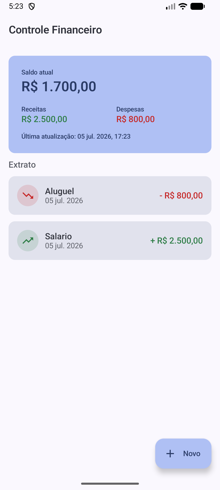
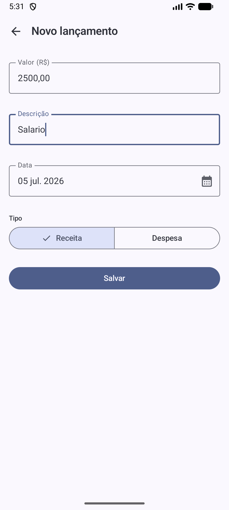
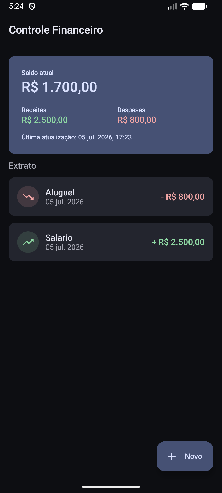
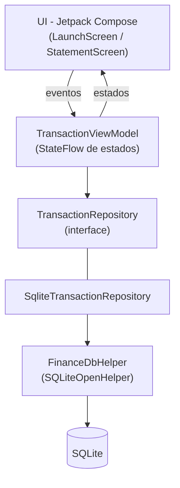
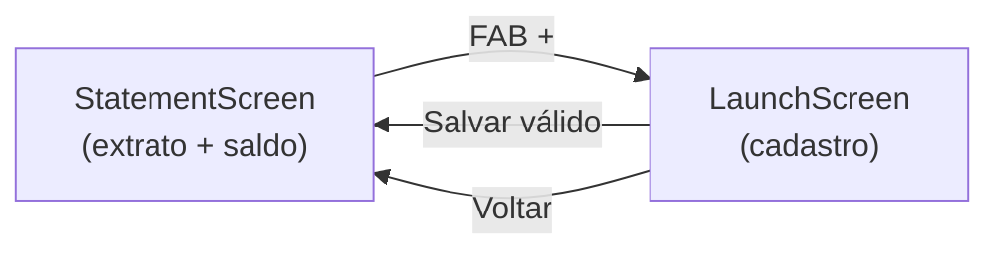

<h1 align="center">💸 FinanceFlow</h1>

<p align="center">
  Controle de fluxo de caixa para Android — cadastre receitas e despesas e acompanhe seu saldo em tempo real.
</p>

<p align="center">
  
  
  
  
  
  
</p>

<p align="center">
  
  &nbsp;&nbsp;
  
  &nbsp;&nbsp;
  
</p>

## 📖 Descrição

**FinanceFlow** é um aplicativo Android nativo de controle de fluxo de caixa. Ele
permite registrar receitas e despesas e acompanhar o extrato com o saldo
calculado automaticamente. O projeto foi construído como Trabalho Final da
disciplina **Android Aplicado** da Especialização em Programação para
Dispositivos Móveis (UTFPR — Campus Pato Branco).

O foco é código limpo, arquitetura em camadas (MVVM) e interface moderna com
Material Design 3, respeitando o conteúdo ministrado na disciplina.

## ✨ Features

- Cadastro de lançamentos (receita ou despesa)
- Extrato em lista com descrição, data, valor e tipo
- Diferenciação visual de crédito (verde) e débito (vermelho)
- Saldo calculado automaticamente, com totais de receitas e despesas
- Seleção de data via DatePicker do Material 3
- Validação de campos com mensagens amigáveis
- Confirmação visual ao salvar (Snackbar)
- Persistência local com SQLite
- Tema claro, tema escuro e Dynamic Color (Android 12+)
- Internacionalização completa (português e inglês)

## 🏗 Arquitetura

O aplicativo segue o padrão **MVVM** com separação clara de responsabilidades. A
UI observa estados expostos pela `ViewModel` e nunca acessa o banco diretamente —
todo acesso a dados passa pelo `Repository`.



## 📱 Screenshots

| Extrato (claro) | Novo lançamento | Extrato (escuro) |
|:---:|:---:|:---:|
|  |  |  |

> As imagens ficam em `assets/screenshots/`.

## 🎨 Material Design 3

- Tema próprio em `ui/theme` com esquema de cores, tipografia e suporte a
  modo claro/escuro.
- **Dynamic Color** aplicado automaticamente em dispositivos Android 12+.
- Cores semânticas de receita/despesa expostas via `CompositionLocal`, adaptadas
  para cada tema.
- Componentes M3: `Card`, `TopAppBar`, `FloatingActionButton`,
  `SegmentedButton`, `OutlinedTextField` e `DatePicker`.

## ⚙ Tecnologias

- Kotlin
- Jetpack Compose + Material 3
- MVVM (ViewModel + StateFlow)
- SQLiteOpenHelper
- Navigation Compose
- LazyColumn
- DatePicker (Material 3)

## 🗄 Persistência

A persistência usa **SQLiteOpenHelper**. O esquema é definido em
`FinanceContract`, a criação/atualização do banco em `FinanceDbHelper` e o acesso
aos dados em `SqliteTransactionRepository`, que implementa a interface
`TransactionRepository`. A UI e a ViewModel dependem apenas da interface, nunca de
SQL.

## 📂 Estrutura do Projeto

```
app/src/main/java/br/edu/utfpr/financeflow/
├── data/
│   ├── database/     # FinanceContract, FinanceDbHelper (SQLiteOpenHelper)
│   ├── model/        # Transaction, TransactionType
│   └── repository/   # TransactionRepository + SqliteTransactionRepository
├── ui/
│   ├── launch/       # LaunchScreen (cadastro)
│   ├── statement/    # StatementScreen (extrato)
│   ├── components/   # BalanceCard, TransactionItem, TypeSelector, EmptyState
│   └── theme/        # Color, Type, Theme
├── navigation/       # Screen, FinanceNavGraph
├── viewmodel/        # TransactionViewModel + estados + Factory
├── utils/            # MoneyFormatter, DateFormatter, TransactionValidator, BalanceCalculator
└── MainActivity.kt
```

## 🧭 Fluxo da Aplicação



## 🚀 Como Executar

Pré-requisitos: Android Studio, JDK 17+ e Android SDK 36.

```bash
git clone https://github.com/jeancarlosaps/FinanceFlow.git
cd FinanceFlow
./gradlew assembleDebug      # gera o APK de debug
./gradlew installDebug       # instala em um dispositivo/emulador conectado
```

Ou abra o projeto no Android Studio e execute o app.

## 🧪 Testes

Testes unitários com JUnit cobrindo as regras de negócio:

```bash
./gradlew testDebugUnitTest
```

- `MoneyFormatterTest` — parsing e formatação monetária
- `TransactionValidatorTest` — validação dos campos
- `BalanceCalculatorTest` — cálculo do saldo e totais
- `TransactionViewModelTest` — comportamento da ViewModel com repositório falso

## 📋 Checklist da Avaliação

Consulte [CHECKLIST.md](CHECKLIST.md) para o mapeamento completo dos itens
avaliados. Todos os itens obrigatórios e os três bônus estão implementados.

## 📚 Aprendizados

- Organização de um app Compose em camadas MVVM sem frameworks de DI.
- Persistência manual com SQLiteOpenHelper e mapeamento cursor → modelo.
- Estados unidirecionais com `StateFlow` e testes de ViewModel via interface.
- Material 3, Dynamic Color e temas claro/escuro.

## 🔮 Melhorias Futuras

- Edição e exclusão de lançamentos
- Filtro por período e por tipo
- Categorias e gráficos de despesas
- Exportação do extrato

## 👨‍💻 Autor

Desenvolvido por **Jean Carlos** — Especialização em Programação para
Dispositivos Móveis, UTFPR.

[](https://github.com/jeancarlosaps)
[](mailto:jeancarlosaps@yahoo.com.br)

## 📄 Licença

Uso acadêmico. Consulte [LICENSE](LICENSE).
